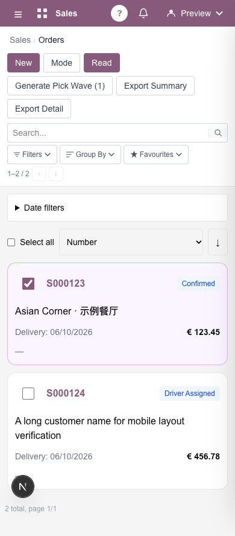
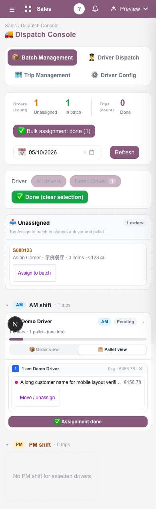
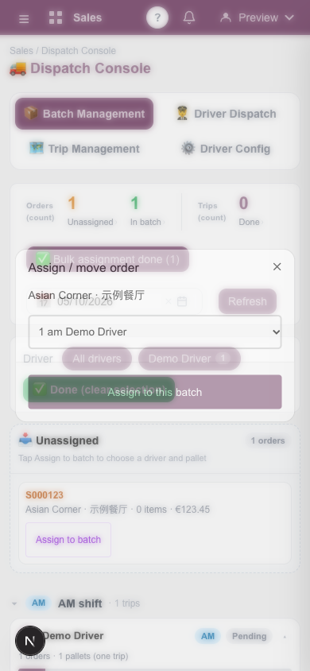
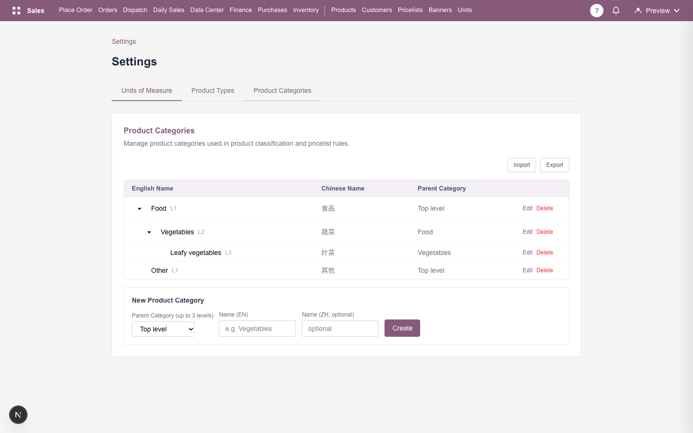

# 商品分类三级化与移动端适配验收

对应计划：`20261004-product-category-mobile-dev-plan.md`。

## 已实现

- 商品分类新增 `parentId` 自关联，最多三级。存量分类保持顶级，不自动重新归类。
- 设置 → 商品分类使用树形列表，支持展开、折叠、新建时选父级、编辑时变更父级。
- 服务端检查父分类存在、自身/子孙循环、移动整棵子树后的最大深度；事务锁串行化分类结构变更，避免并发绕过校验。
- 有子分类或关联商品的分类不能直接删除，需先移走关联内容。
- `/api/product-categories` 默认继续返回扁平数组；`?tree=1` 返回带 `children`、`depth` 的树形数组。设置界面使用 `?fresh=1`，编辑后立即读取最新结构。
- 手机端（小于 768px）顶部导航收起为抽屉菜单，支持关闭、Escape 和导航跳转。
- 公共工具栏支持按钮换行，搜索、筛选、收藏、分页在窄屏保持可用。
- 报价、订单在手机端显示卡片：单号、客户、交货日期、金额、状态；保留选择、全选、批量操作、排序、日期筛选和详情入口。订单卡片支持编辑司机/批次。
- 配送批次管理改为手机端上下布局，增加点击分配、切换司机/托盘、移回待分配。复用桌面拖拽的接口和锁定/已出发校验，失败时保持弹窗供重试。
- 桌面端保留表格和拖拽操作。配送出发功能继续遵守系统已有的司机端启用开关。

## 验证

- `npm run typecheck` 通过。
- 分类树测试覆盖三级新建、第四级拒绝、自身/子孙循环、父级不存在、子树整体移动和已有循环数据。
- 分类及定价回归共 31 项测试通过，保留现有按单个 `categoryId` 定价的语义。
- 浏览器回归覆盖中英文报价/订单在 360、390、768、1440px 下的页面宽度、卡片/表格切换和选择操作；覆盖导航抽屉、配送分配/移出、分类树折叠及合法父级选项。
- 浏览器回归使用拦截接口的测试数据，截图为预览数据，不写真实业务记录。
- 已应用迁移 `20261005000002_product_category_tree` 到当前配置的数据库。
- 数据库只读验收通过：33 个分类、33 个顶级分类，迁移后未重新归类；事务锁查询正常。
- 新增逻辑的 ESLint 通过。检查现有共享组件时，发现 `OdooControlPanel.tsx` 原有 `react-hooks/set-state-in-effect` 错误（收藏读取逻辑），未在本次范围内修改。
- 扩展权限回归发现 `rbac-gate.test.ts`、`rbac-route-map.test.ts` 各有一项原有冻结基线对比失败，涉及已存在的注册、公告、批量导入等路由；本次未变更权限表及其基线。可通过 `CATEGORY_MOBILE_RBAC_CHECK=1` 额外执行这组检查。

重复验证：

```sh
bash scripts/verify-product-category-mobile.sh
CATEGORY_MOBILE_BROWSER_CHECK=1 CATEGORY_MOBILE_PREVIEW_URL=http://localhost:3001 bash scripts/verify-product-category-mobile.sh
npx tsx scripts/audit/verify-category-tree-db.ts
```

浏览器检查默认使用本机 Chrome；其他环境通过 `CATEGORY_MOBILE_CHROME` 指定浏览器可执行文件。启动开发服务后再执行浏览器检查。

## 界面预览

### 手机订单



### 手机配送



### 手机分配弹窗



### 三级分类配置



其他截图（中英文、桌面列表、手机导航）位于 `docs/preview/20261005-category-mobile/`。

## 范围

按计划，其他页面的 `categoryId` 下拉与分类筛选保持原语义，父分类筛选不自动包含子分类。存量分类由管理员在设置页手工选择父级整理。备份、首页预加载优化不在本次开发范围内。
