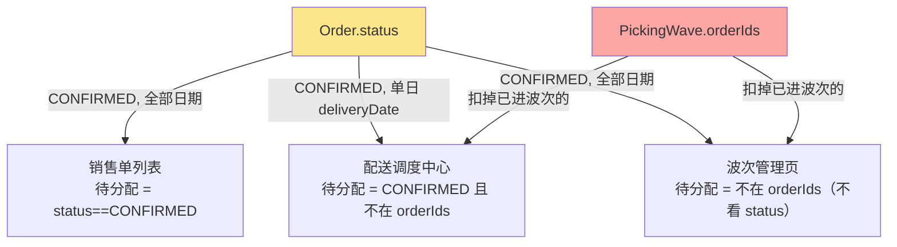
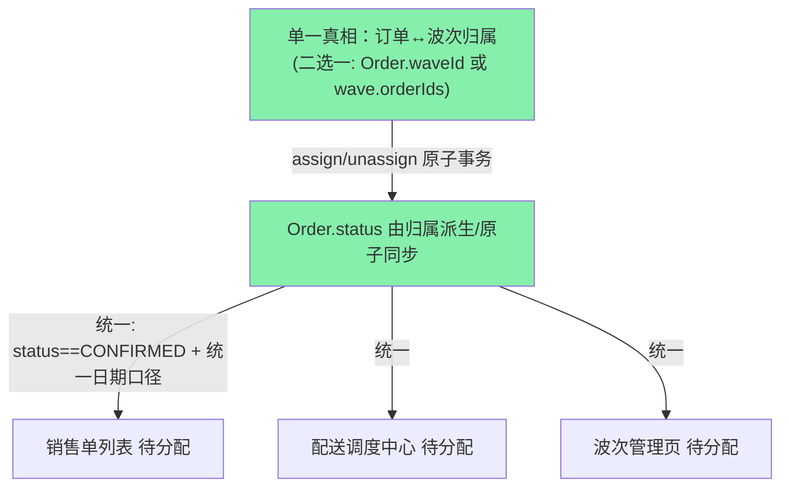

# 待分配订单逻辑梳理（现状 / 应有 / 差异）

> 日期：2026-07-06　目的：厘清「同一天订单在销售单列表 / 配送调度中心 / 波次管理页三个界面显示的『待分配』对不上」的完整逻辑。**本文档只梳理，不改代码。**
> 状态：本次方案 2（assign/unassign 回写状态）已改 4 个文件，仍在工作区、未提交。

---

## 0. 一句话结论

「待分配」在系统里**没有唯一真相**：`Order.status` 和 `PickingWave.orderIds` 是两套并存、互不同步的记录；三个界面各用不同的**数据源 + 日期口径 + 判定规则**去算「待分配」，必然对不上。这正是 `docs/20260624-data-ownership-audit.md` 记录的 P0 病灶。

---

## 1. 涉及的界面（共 3 个，不止 2 个）

| # | 界面 | 代码 | 是否有「待分配 + 分配操作」 |
|---|------|------|--------------------------|
| 1 | 销售单列表 | `app/[locale]/classic/operator/orders/page.tsx` | 有「已确认」筛选（被当作待分配），可「生成批次」 |
| 2 | 配送调度中心 | `app/[locale]/classic/operator/dispatch-console/_components/BatchTab.tsx` | 有「待分配」栏，拖拽分配 |
| 3 | 波次管理页（旧） | `app/[locale]/classic/operator/waves/page.tsx` | 有「待分配池」，拖拽分配 |

> 第 3 个页面仍活跃：销售单列表点「生成批次」成功后 `router.push('.../classic/operator/waves/${waveId}')` 会跳进去（`orders/page.tsx:276`）。它与配送调度中心是**两套平行的分配 UI**。
>
> 其余界面（会计 `accounting`、行程 `trips`、日销统计 `daily-sales`、库存差异 `inventory/discrepancies`、打印中心 `dispatch-print-data`）**没有「待分配」功能**，只读订单状态展示，不参与分配；但会被「订单状态口径」间接影响（见 §6）。

---

## 2. 数据模型（据代码归纳）

**Order（订单）关键字段**
- `status`：`PENDING | CONFIRMED | WAVE_ASSIGNED | IN_DELIVERY | COMPLETED`
- `deliveryDate`：配送日期。**下单时**由订单表单 `data.deliveryDate` 写入（计划配送日，`orders/route.ts:328`）；**确认出发时**被覆盖为波次排程日（`waves/[id]/dispatch/route.ts:24-32`）。
- `driverSlotId`：司机档位（下单时可写、销售单列表「生成批次」时可写）
- `items`（JSON）、`restaurantName`、`code`、`quotationDate` 等

**PickingWave（波次）关键字段**
- `orderIds`：`String[]`，该波次包含的订单 ID —— **另一套「订单归属」真相**
- `driverSlotId`：绑定的司机档位
- `status`：`PENDING(待理货) | ...`
- `dispatchedAt`：确认出发时间（防重复出发）
- `assignmentDoneAt`：分配完成标记
- `zones`：按餐厅聚合的理货清单（派生自 orderIds）

---

## 3. 订单状态机（现状）

```
PENDING          待确认（草稿/新单）
  │  确认订单（销售单列表）→ status=CONFIRMED，扣库存
  ▼
CONFIRMED        已确认（现状下 = 「待分配」的主状态）
  │  生成批次（销售单列表）→ 建 wave + status=WAVE_ASSIGNED
  │  ★拖拽分配（配送/波次页）→ 只改 wave.orderIds，status 不变（病灶）
  ▼
WAVE_ASSIGNED    司机分配结束
  │  确认出发（配送调度中心）→ status=IN_DELIVERY + 覆盖 deliveryDate=排程日 + wave.dispatchedAt
  ▼
IN_DELIVERY      配送中
  │  完成
  ▼
COMPLETED        已完成
```

**关键矛盾集中在 CONFIRMED 这一格**：一张单可以「已进某个波次（在 wave.orderIds 里）」但 `status` 仍是 `CONFIRMED`，因为拖拽分配不回写状态。于是它到底算不算「待分配」，取决于你问哪个界面。

---

## 4. 现状：三个界面各自怎么算「待分配」

| 界面 | 取数请求 | 日期口径 | 「待分配」判定 | 真相来源 |
|------|----------|----------|----------------|----------|
| **销售单列表** | `/api/orders?status=CONFIRMED,...` | **无日期过滤**（全部日期） | `Order.status === CONFIRMED` | 只信 `Order.status` |
| **配送调度中心** | `/api/orders?status=CONFIRMED,IN_DELIVERY&dateField=deliveryDate&fromDate=toDate=当天` | **单日** `deliveryDate` | `status===CONFIRMED && 不在任何 wave.orderIds` | `wave.orderIds` + 单日 deliveryDate |
| **波次管理页** | `/api/orders?status=CONFIRMED&limit=500` | **无日期过滤** | `不在 assignedOrderIds`（**不看 status**） | 只信 `wave.orderIds` |

> API 过滤逻辑：`orders/route.ts` GET 支持 `?status=`（逗号分隔，`where.status IN`）与 `?dateField=deliveryDate&fromDate&toDate`（`where.deliveryDate` 区间）。默认 dateField 是 `createdAt`。

### 现状数据流（Mermaid）



---

## 5. 为什么对不上（三层差异）

### 第 1 层：日期口径不同 → 数量差
- 配送调度中心只拉 `deliveryDate = 当天` 的订单。
- 销售单列表 / 波次管理页**不按日期**，把所有日期的 CONFIRMED 一锅端。
- 结果：销售单列表 / 波次管理页的「待分配」几乎总是 ≥ 配送调度中心（含了别的日期、未来还没排期的单）。
- **（已用代码确认）** `deliveryDate` 在**下单时**就由订单表单写入（`orders/route.ts:328`），所以未出发的 CONFIRMED 订单本来就带有 `deliveryDate`，配送调度中心按 `deliveryDate` 单日过滤才能正常工作。「确认出发」只是把它**覆盖**为实际排程日（`dispatch/route.ts:24-32`）。

### 第 2 层：判定来源不同 → 编号差
- 配送调度中心 / 波次管理页会**扣掉「已进某个波次」的订单**（读 `wave.orderIds`）。
- 销售单列表**完全不看波次**，只要 `status===CONFIRMED` 就算待分配。

### 第 3 层：写入点分裂 → 同一单两边错位（核心病灶）
- 在配送调度中心 / 波次管理页**拖拽分配**订单时，只改了 `wave.orderIds`，**没回写 `Order.status`**。
- 于是同一张单：
  - 配送调度中心 / 波次管理页：已从「待分配」消失（进了司机栏）。
  - 销售单列表：`status` 还是 `CONFIRMED`，仍显示为「已确认 / 待分配」。
- 这就是「像两套数据」的直接原因。

---

## 6. 附带的隐患（不是本问题主因，但同源）

- **波次管理页不看 status**（`unassignedOrders = allOrders.filter(!assignedOrderIds)`）：因 orders 无日期过滤、waves 只取当天，跨日期已分配单可能混入待分配池。
- **大小写不一致**：波次管理页 `normalizeOrder` 把 status 转小写，配送调度中心用大写 —— 同一份逻辑两种写法，易出错。
- **会计页漏枚举 `WAVE_ASSIGNED`**（`accounting/page.tsx:78`），且状态徽章遇未知状态直接显示 `ERROR`（`accounting/page.tsx:570`）。订单一旦落到 WAVE_ASSIGNED，会计页会漏单 + 显示 ERROR。
- `WAVE_ASSIGNED` 状态**现在就已存在**（生成批次即产生），上述漏枚举是**既有 bug**，不是方案 2 新引入；方案 2 会让更多订单落到该状态而放大它。

---

## 7. 应有的逻辑（目标）

核心原则：**「订单归属哪个波次」只保留一处真相，其余全部只读它或从它派生。三个界面统一读源、统一日期口径、统一判定。**

### 目标状态机（语义收紧）
```
CONFIRMED        已确认 且 未进任何波次   ← 唯一的「待分配」
WAVE_ASSIGNED    已确认 且 已进某个波次   ← 分配即置位，移出即退回
IN_DELIVERY      已出发
COMPLETED        已完成
```
即：**`status == CONFIRMED ⇔ 不在任何 wave.orderIds`**，让 status 成为「是否已分配」的可信单一信号。

### 目标数据流（Mermaid）


### 达成目标的改动（Strangler 分阶段）

- **方案 2（止血，进行中）**：assign / unassign 时**原子回写** `Order.status`（进波次→WAVE_ASSIGNED，移出→CONFIRMED），并放宽 assign 校验以支持跨波次 move。
  - 已改 4 个文件（见文末）。**会计页那处漏改需补**，且 `updateMany` 尚未包进事务。
  - 还需：一次性**历史数据订正脚本**（把「已在某 wave.orderIds 里但 status 仍 CONFIRMED」的存量订单批量置为 WAVE_ASSIGNED），否则老数据仍对不上。
- **统一日期口径**：三个界面对「待分配」是否按 `deliveryDate` 过滤、按哪个日期，必须一致（产品口径，见 §8）。
- **方案 3（根治 SSOT）**：订单归属波次只存一处（推荐 `Order.waveId` 单值，或维持 `wave.orderIds` 数组），另一处改为派生；所有读「待分配」的地方只读这一处；assign/unassign 用 `prisma.$transaction` 保证 `归属 + status` 原子。
- **收敛重复 UI**：配送调度中心 与 波次管理页是两套平行分配界面，长期应合并或明确废弃其一。

---

## 8. 已确认的决策（2026-07-06）

1. ~~`deliveryDate` 写入时机~~ —— **已确认**：下单时写入（计划配送日），确认出发时覆盖为排程日。
2. **待分配口径 = 当天**：以 `deliveryDate = 当天` 为准（配送调度中心本就如此；波次管理页要废弃；销售单列表维持订单全量表，靠 status 回写让已分配单退出「已确认」筛选）。
3. **归属真相 = `wave.orderIds`**（不改 schema）。`Order.status` 是它的**派生镜像**，凡改 `wave.orderIds` 的写入点必须原子回写 status。
4. **UI 保留配送调度中心，废弃波次管理列表页**（`operator/waves/page.tsx`）；`waves/[id]/` 司机拣货详情页保留。

---

## 9. 执行计划（Strangler，分阶段）

> 因归属真相 = `wave.orderIds`，方案 3「根治」的核心机制其实就是方案 2 的「原子回写 status」——两者合流。落地顺序：

### Phase A — 状态回写 + 数据订正（止血 + 根治核心）
- A1. `assign` / `unassign` 回写 status —— **已改**，待补：把 `wave.update + order.updateMany` 包进 `prisma.$transaction` 保证原子。
- A2. 其它改 `wave.orderIds` 的写入点也回写 status：`waves` POST（建波次带 orderIds）；确认「生成批次」链路的 status 置位是否原子。（`generate-daily` 建空波次，不涉及。）
- A3. **补会计页** `accounting/page.tsx`：查询加 `WAVE_ASSIGNED`；徽章补 `WAVE_ASSIGNED` 文案（去掉 `ERROR` fallback）。
- A4. **历史数据订正脚本**（一次性）：
  - 凡 `∈ 任何 wave.orderIds` 且 `status=CONFIRMED` → `WAVE_ASSIGNED`
  - 凡 `status=WAVE_ASSIGNED` 但 `∉ 任何 wave.orderIds` → `CONFIRMED`（清脏数据）
  - 跑前先备份 + dry-run 计数。

### Phase B — 废弃波次管理列表页（清理）
- B1. 改「生成批次」跳转（`orders/page.tsx:276-277`）：统一跳 `dispatch-console`（或 wave `[id]` 详情），不再跳列表页。
- B2. 删除 `operator/waves/page.tsx`（列表页）+ 撤销方案 2 对它的编辑。
- B3. 清理垃圾备份：`waves/[id]/page_original_backup.tsx`、`DriverWaveClient_backup.tsx`、`pickicing.tsx`。

### Phase C — 加固（防回归）
- C1. 把「改 orderIds 后同步 status」抽成公共函数（如 `lib/wave-order-sync.ts`），assign/unassign/POST 统一调用，避免以后再漏。
- C2. `db:validate` 增业务不变量：`status==CONFIRMED ⇔ ∉ 任何 wave.orderIds`（纳入既有校验体系）。

### 待你再拍板的小分歧
- 「生成批次」成功后跳去哪：**配送调度中心**（推荐）还是 wave `[id]` 详情页？
- 销售单列表要不要加一个「当天待分配」快捷筛选？（默认：不加，维持现状筛选）

---

## 10. 执行进度（2026-07-06）

### Phase A — 状态回写 + 数据订正 ✅ 代码完成（A4 写库待批准）
- A1 ✅ `assign` / `unassign` 回写 status 已包进 `prisma.$transaction`（含 assign 的 otherWaves 移除）。
- A2 ✅ `waves` POST 建波次带 orderIds 时在事务内原子回写 `CONFIRMED→WAVE_ASSIGNED`；`waves/[id]` 通用 PUT 剥掉 `orderIds` 防绕过同步。
- A3 ✅ `accounting/page.tsx` 查询加 `WAVE_ASSIGNED`，徽章补「司机分配结束」文案（琥珀色）。
- A4 ⏳ 订正脚本 `scripts/fix-wave-order-status.ts`（dry-run 先行）。**dry-run 结果：31 单在波次里但仍 CONFIRMED 需升级，0 反向孤儿。写库待用户批准 `--apply`。**

### Phase B — 废弃波次管理列表页 ✅ 完成
- B1 ✅ 「生成批次」改为跳 `dispatch-console`，并删除冗余的逐个 status PUT（waves POST 已原子回写）。
- B2 ✅ **偏差说明**：原计划硬删列表页，实际发现它并非完全脱离导航——`OdooNav` 应用切换格「拣货/Picking」+ `flow` 引导页仍指向它。故改为**更安全的方案**：列表页 `waves/page.tsx` 改为**重定向到 dispatch-console 的服务端 stub**（兜底旧书签），并把 `OdooNav`(×2) 与 `flow`(×2) 链接直接重指到 dispatch-console。`waves/[id]` 详情页保留。
- B3 ✅ 无垃圾备份文件需清理（早前会话的 7 文件列表系工具损坏时的伪造输出，git 确认 `[id]/` 只有 `page.tsx`）。

### 验证
- `npx tsc --noEmit` ✅ 通过（Phase A + B 全量类型检查无错）。
- 待办：A4 `--apply` 写库；`npm run build`；三界面一致性的 E2E 走查（建议 A4 应用后进行）。

---

## 附：已改动文件（未提交）
- `app/api/waves/[id]/assign/route.ts`、`app/api/waves/[id]/unassign/route.ts`、`app/api/waves/route.ts`、`app/api/waves/[id]/route.ts` —— 状态原子回写 + 防绕过
- `app/[locale]/classic/accounting/page.tsx` —— 会计页 WAVE_ASSIGNED
- `app/[locale]/classic/operator/dispatch-console/_components/BatchTab.tsx` —— 查询加 WAVE_ASSIGNED
- `app/[locale]/classic/operator/orders/page.tsx` —— 生成批次跳转 dispatch-console + 去冗余
- `app/[locale]/classic/operator/waves/page.tsx` —— 改为重定向 stub
- `components/classic/OdooNav.tsx`、`app/[locale]/classic/operator/flow/page.tsx` —— 拣货/Picking 链接重指 dispatch-console
- `scripts/fix-wave-order-status.ts` —— 数据订正脚本（dry-run 先行）
